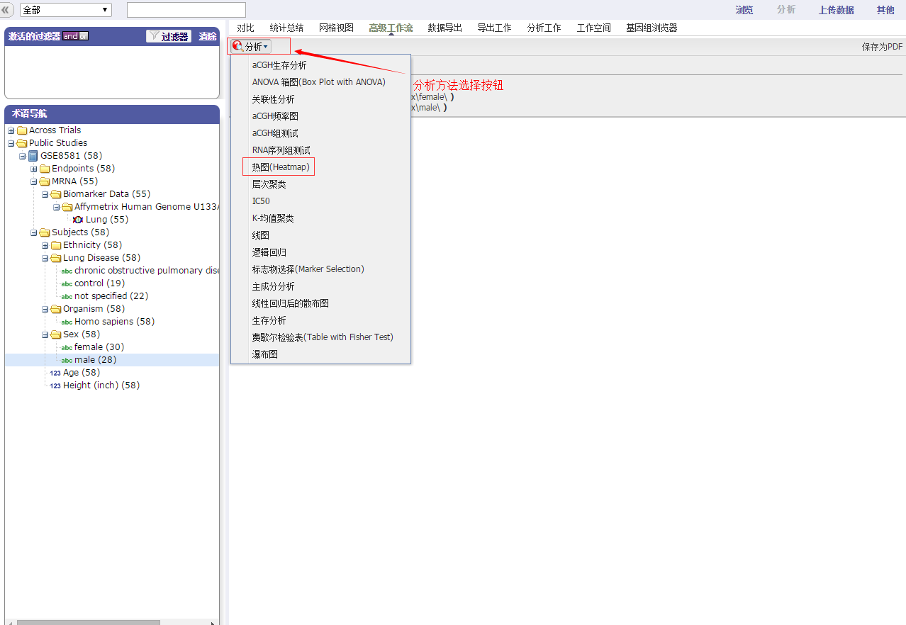
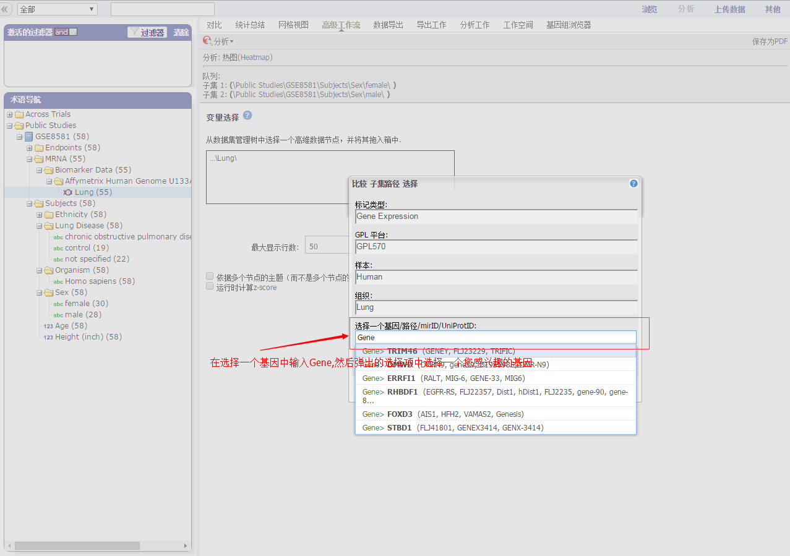
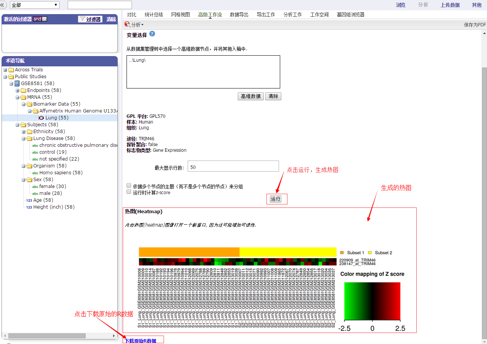

# 高级工作流
tranSMART 提供了数据高级的分析和可视化，允许用户进行如下的数据集管理：
* aCGH生存分析
* ANOVA箱图(Box Plot with ANOVA)
* 关联性分析
* aCGH频率图
* aCGH组测试
* RNA序列组测试
* 热图(Heatmap)
* 层次聚类
* IC50
* K-均值聚类
* 线图
* 逻辑回归
* 标志物选择(Marker Selection)
* 主成分分析
* 线性回归后的散布图
* 生存分析
* 费歇尔检验表(Table with Fisher Test)
* 瀑布图

数据集管理器使用R软件环境进行数据计算，生成分析和可视化。有关更多信息，请访问：http://www.r-project.org.

## 生成热图
在一个数据集管理器中，生物标志会出现在y轴上，受试者会出现在x轴上。生成一个热图步骤如下：

1.进入'分析'标签，拖动'female'节点到子集1中，然后拖动'male'节点到子集2中。

2.进入'高级工作流'标签，点击'分析'选择按钮，选择'热图'分析。

3.在变量选择框中拖入一个高维的数据节点，如'Lung'节点。点击'高维数据'按钮，在选择一个基因中中输入'Gene'，在弹出的选择项中选择一个您感兴趣的基因，最后点击应用选择。

4.点击'运行'按钮，生成热图。

